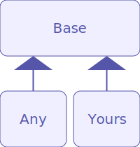

# selenium-pages


selenium-pages is a package for you who want to use selenium and manage some pages with your own classes simply.

Let's just get started and learn little by little, if needed.

## Installation
``` shell
npm install selenium-pages
```

for TypeScript, below line may be good too
``` shell
npm install -D @types/selenium-webdriver
```

## Prerequisites
Web drivers are installed and the paths for the drivers are ready.

## Usage

#### Basics
You can use Page.Any class for getting started or lightly use.
``` typescript
import { Selen } from "selenium-pages";

const pageOptions = {
  origin: "https://www.google.com", // home page origin
  maxWaitMs: 10000 // timeout
};

(async () => {
///

const driver = await Selen.Build("chrome");

const page = new Selen.Pages.Any(driver, pageOptions);

await page.goHome();

console.log(await page.getCurrentUrl());

console.log(await page.getTitle());

await page.goTo("/search?q=test");

console.log(
  await page
    .querySelectorAll("div.g h3")
    .then(
      elements => Promise.all(elements.map(
        element => element.getText()
      ))
    )
);

await driver.quit();

///
})();
```

### Structures
<p align="center">
  
</p>

#### How to extend the base class
You can extend the base class for your own use.
``` typescript
import { Selen } from "selenium-pages";

const pageOptions = {
  origin: "https://www.google.com",
  maxWaitMs: 10000
};

(async () => {
///

// customized page class definition
class Test extends Selen.Pages.Base {
  async workSome(){
    await this.executeScript(`
      document.body.appendChild(document.createElement('div')).innerHTML = "test";
    `);
  }
}

// registration
Selen.Pages.add(Test);

const driver = await Selen.Build("chrome");

// you can new Selen.Pages[your customized class name]
const testPage = new Selen.Pages.Test(driver, pageOptions);
await testPage.goHome();

// you can use your methods
await testPage.workSome();

///
})();
```

#### How to use customized options
You can extend SelenOptions and use it in your class instance methods.
``` typescript
import { Selen, SelenOptions } from "selenium-pages";

type CustomOptions = SelenOptions & {
  some: string;
};

class Custom extends Selen.Pages.Base<CustomOptions> {
  public workSome(){
    console.log(this.options.some);
  }
}

Selen.Pages.add(Custom);

const customPage = new Selen.Pages.Custom(driver, {
  origin: "https://...",
  maxWaitMs: 10000,
  some: "thing"
});
```

#### How to use style dictionary
styleDictionary is ready for you to name the selector strings.
``` typescript
import { Selen } from "selenium-pages";

class Custom extends Selen.Pages.Base {
  protected initializeStyleDictionary(){
    this.styleDictionary.renew({
      inputBox: "div form input[name='some']",
      button: "div form button[type='submit']"
    });
  }
}

Selen.Pages.add(Custom);

(async () => {
///

const customPage = new Selen.Pages.Custom(driver, someOptions);
await customPage.querySelector("inputBox")
  .then(box => box.sendKeys("hello"));
await customPage.querySelector("button")
  .then(button => button.click());

///
})();
```
